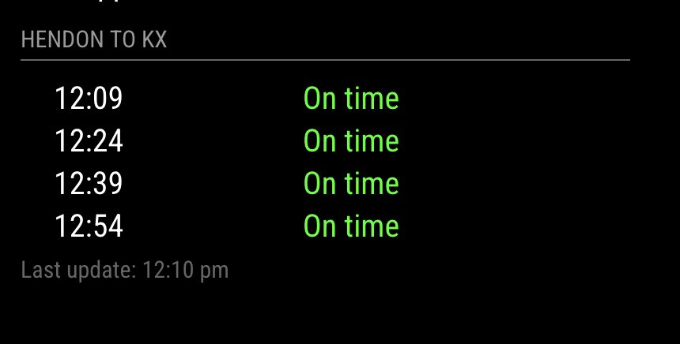

# MMM-TrainStatus

A MagicMirror² module to display train schedules from a local API with dynamic direction switching based on commute periods.

## Features
- Displays Scheduled and Expected departure times.
- Color-coded status (On time, Delayed, Cancelled).
- Dynamic Direction Switching: Automatically switches origin/destination and titles based on the time of day (e.g., Morning vs. Evening commute).
- Auto-hiding: Module hides itself outside of configured commute windows.
- "Last Update" timestamp display.

## Installation
Clone this repo into your `modules` directory:
\`bash
cd ~/MagicMirror/modules
git clone <YOUR_REPO_URL>
\`

## Configuration
Add the module to your `config/config.js` file:
\`javascript
{
    module: "MMM-TrainStatus",
    position: "top_left",
    config: {
        updateInterval: 60 * 1000,
        periods: [
            {
                start: "07:00",
                end: "11:00",
                origin: "HEN",
                destination: "STP",
                title: "Hendon to KX"
            },
            {
                start: "15:00",
                end: "19:00",
                origin: "STP",
                destination: "HEN",
                title: "KX to Hendon"
            }
        ]
    }
}
\`
